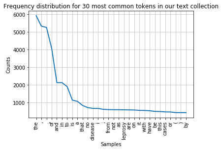
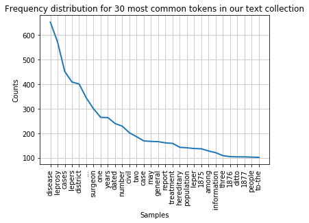
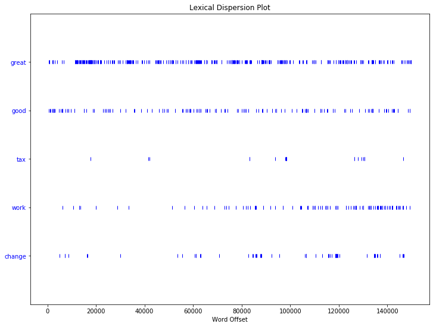
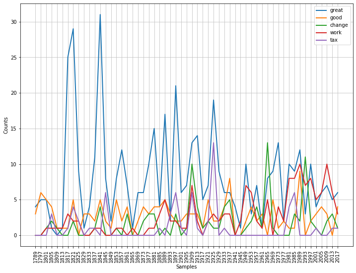

# Text Mining Lesson - Day 1

## 1. Introduction

Welcome to a hands-on exercise that can be used to learn some text mining skills. Here we will run through some of the basics that you might need when exploring and analysing text.

To start with here is a bit of basic terminology that we will use:

__Token:__ is single word, letter, number or punctuation mark

__String:__ group of characters comprised of words, letters, numbers, punctuation

__Integer:__ positive or negative whole numbers with no decimal point

__Document:__ a single file containing some text

__Corpus:__ a collection of documents


We will be running this lesson within a jupyter notebook so please type jupter notebook into the command window on your machine.  To do that you need to open a terminal window and type:
jupyter notebook
### 1.1 Introduction to Python

Python is a programming language. We will use this as a way to interact with out text documents. We can use Python either through the command line in your terminal window, by writing Python scripts or via Jupyter Notebook. Today we will be using Jupyter Notebook.

We first want to test that the Python works by asking it to print a string, so type ```print("Hello World")``` into the next Jupyter Notebook cell as shown below and run it as code.


```python
print("Hello World")
```

    Hello World


Python can assign information to variables. A variable is a memory location used to hold data which has a name associated with it. For example we can save a string as the variable named text:


```python
text = "Text Mining"
```

You can then print the value of this variable as shown:


```python
print(text)
```

    Text Mining


In addition to strings we can save other data types such as numbers and floats.  Not that whenever something is followed by the ```#``` sign in Pythen then it is a comment and not part of the code.  Comments are used to explain the code but are not needed to run it.


```python
text = "Text Mining"  # An example of a string
number = 42  # An example of an integer
pi_value = 3.1415  # An example of a float
```

In this lesson we will be concentrating on strings. 

__Lists:__ Data can be grouped together in an ordered way using a List. Lists are very common data structures used in Python. A list holds an ordered sequence of elements and each element can be accessed using its index or position in the list. __Note that Python indexes start with 0 instead of 1.__

Lists are created by typing comma serparated values inside square brackets.  You can print out all elements in the list or elements at specifc positions in the list:


```python
colours =['red', 'yellow', 'green']
print(colours) # print all elements
print(colours[0]) # print the first element
```

    ['red', 'yellow', 'green']
    red


Or print a slice of the list (e.g. the first two elements of the list):


```python
colours[0:2]
```


    ['red', 'yellow']


An item can be added to a List:


```python
colours.append('blue')
print(colours) # prints the entire list at once
```

    ['red', 'yellow', 'green', 'blue']


__for Loop:__ A for loop can be used to access the elements in a list one at a time:


```python
for colour in colours:
    print(colour) # prints each element of the list one after the other
```

    red
    yellow
    green
    blue


__if/elif/else Statements:__ An if/elif/else statement can be used to condition some code on something being true or false.  If the test that follows the statement is true, then its body (i.e., the lines indented underneath it) are executed.  Here we use the ```len()``` method to count the length of the colours list which returns an interger and we use operators (```==``` for is equal to and ```>``` for is greater than). 


```python
if len(colours) == 5:
    print("The colours list contains 3 colours.")
elif len(colours) > 5:
    print("The colours list contains more than 5 colours.")
else:
    print("The colours list contains less than 5 colours.")

print(colours)
```

    The colours list contains less than 5 colours.
    ['red', 'yellow', 'green', 'blue']


__A tuple__ is similar to a list as it is an ordered sequence of elements. But, tuples can not be changed once created and are created by placing comma-separated values inside parentheses:


```python
colour_tuple = ('blue', 'green', 'red')
print(colour_tuple[1]) # prints the 2nd entry in the tuple
```

    green


__Dictionaries:__ Dictionaries work a lot like lists but they have a 'key' that accesses the 'value'. The key acts as a name for a single or a set of values in the dictionary.


```python
pets = {'cats':'one', 'dogs':'two', 'mice':'three'}
print(pets['cats']) # prints the value of the key 'cats'
```

    one


We can use for loops to print the keys and values:


```python
for key, value in pets.items():
    print(key, value)
```

    cats one
    dogs two
    mice three


__Task 1.1: Print a bit of text of your choice.__

__Task 1.2: Create a list containing different first names, iterate through them .__

## 2. Downloading and importing packages and code

### 2.1 Download Files

We need to download code and data for processing later in the course. Please refer to the pre-requisites page to make sure you have downloaded and installed all the necessary tools needed for this lesson. 

### 2.2 Importing Packages

Python has a selection of pre-written code that can be used. These come as in built functions and a library of packages of modules. We have already used the in-built function ```print()```.  In-built functions are avaliable as soon as you start python. There is also a (software) library of modules that contain other functions, but these modules need to be imported. 

For this course we need to import a few libraries into Python. We use this using the ```import``` command. 

NLTK is the tool which we'll be using to do much of the text processing in this workshop so we need to ```import nltk```. We'll also use ```numpy``` to represent information in arrays and matrices, ```string``` to process some strings and ```matplotlib``` to visualise the output.

If there is a problem importing any of these modules you may need to revisit the appropriate pre-requisite item.


```python
import nltk 
import numpy
import string
import matplotlib.pyplot as plt
```

## 3. Initial Processing

### 3.1 Tokenising a piece of text
In order to process text we need to break it down into tokens.  As we said at the start a token is a letter, word, number, or punctuation which is contained in a string.

To tokenise we first need to import the ```word_tokenize``` method from the ```tokenize``` package from NLTK which allows us to do this without writing the code ourselves.


```python
from nltk.tokenize import word_tokenize
```

We will also download a specific tokeniser that NLTK uses as default.


```python
nltk.download('punkt')
```

    [nltk_data] Downloading package punkt to /Users/balex/nltk_data...
    [nltk_data]   Package punkt is already up-to-date!


    True


Now we can assign text as a string variable and tokenise it.  We will save the tokenised output in a list using the ```humpty_tokens``` variable. We can inspect this list by inspecting the ```humpty_tokens``` variable.


```python
humpty_string = "Humpty Dumpty sat on a wall, Humpty Dumpty had a great fall; All the king's horses and all the king's men couldn't put Humpty together again."
humpty_tokens = word_tokenize(humpty_string)
# Show first 10 entries of the tokens list
humpty_tokens[0:10]
```


    ['Humpty', 'Dumpty', 'sat', 'on', 'a', 'wall', ',', 'Humpty', 'Dumpty', 'had']


As you can see some of the words are uppercase and some are lowercase. To futher analyse the data, for example counting the occurances of a word, we need to normalise the data and make it all lowercase. 

We can lowercase the strings in the list by going through it and calling the ```.lower()``` method on each entry. We do this by using a for loop to loop through each word in the list.


```python
lower_humpty_tokens = [word.lower() for word in humpty_tokens]
# Show first 10 entries of the lowercased tokens list
lower_humpty_tokens[0:6]
```


    ['humpty', 'dumpty', 'sat', 'on', 'a', 'wall']


__Task 2.1: Print the 13th token of the nursery rhyme (remember that a list index starts with 0).__

### 3.2 Downloading and Processing Data

#### For a Single Document

Instead of providing a string of text we can download one from an corpus. Here we will, load a file from your local machine, tokenise and lowercase it.

Firstly we download a data set (and make a note of where it is saved).  We will use the Medical History of British India collection provided by the National Libarry of Scotland as an example:

https://data.nls.uk/data/digitised-collections/a-medical-history-of-british-india/

We can use the ```open()``` method to open a file in this collection. You need to specify the path to a file in the downloaded collection (this will be different to the one below depending on where you saved it) and the mode of opening it ('r' for read).

The ```read()``` method is used to read the file. It is then stored as a string variable called ```india_raw```.

We then tokenize it as above and normalize it into lowercase. We can check it has worked by printing out a slice of the list ```lower_india_tokens```.


```python
file = open('/Users/balex/Downloads/nls-text-indiaPapers/74457530.txt','r')
india_raw = file.read()
india_tokens = word_tokenize(india_raw)
lower_india_tokens = [word.lower() for word in india_tokens]
lower_india_tokens[0:10]
```


    ['no', '.', '1111', '(', 'sanitary', ')', ',', 'dated', 'ootacamund', ',']


#### For a Corpus of Documents

We can do the same for an entire collection of documents (a corpus).  Here we choose a collection of raw text documents in a given directory.  We will use the Medical History of British India collection as our data set.

To read the text files in this collection we can use the ```PlaintextCorpusReader``` class provided in the ```corpus``` package of NLTK.  You need to specify the collection directory name and a wildcard for which files to read in the directory (e.g. ```.*``` for all files) and the text encoding of the files (in this case ```latin1```).  Using the ```words()``` method, the text is automatically tokenised and stored in a list of words. As before, we can then lowercase the words in the list.


```python
from nltk.corpus import PlaintextCorpusReader
corpus_root = '/Users/balex/Downloads/nls-text-indiaPapers/'
wordlists = PlaintextCorpusReader(corpus_root, '.*', encoding='latin1')
corpus_tokens = wordlists.words()
print(corpus_tokens[:10])
```

    ['No', '.', '1111', '(', 'Sanitary', '),', 'dated', 'Ootacamund', ',', 'the']


```python
lower_corpus_tokens = [str(word).lower() for word in corpus_tokens]
lower_corpus_tokens[0:10]
```


    ['no', '.', '1111', '(', 'sanitary', '),', 'dated', 'ootacamund', ',', 'the']


__Task 3.1: Print out a larger slice of the list of tokens in the Medical History of British India collection, e.g. the first 30 tokens.__

__Task 3.2: Print out the same slice but for the lower-cased version.__

## 4. Concordances of tokens in text
Next, we will display concoordances for a particular token, i.e. all contexts a particular token appears in. We can do this using the ```Text``` class in NLTK's ```text``` package.  We can represent our list of lowercased tokens in the document collection loaded previously using the Text class.  The concordance list of a token can be displayed using the ```concordance()``` method on this class as shown below.


```python
from nltk.text import Text
t = Text(lower_india_tokens)
t.concordance('woman')
```

    Displaying 20 of 20 matches:
    s of age , a sweeper , who married a woman who had leprosy , and at the age of 
    e of sitabu , aged 40 , a muhammadan woman . her grand- father and father were 
    ung man deliberately married a leper woman , and became himself a leper at the 
    contrary . in no . 6 a man marries a woman whose grandfather and father had bee
     lepers . in no . 10 a man marries a woman whose father had died of leprosy . i
    applies to these cases . in no . 2 a woman marries a man whose father and elder
    n in the case of a man who marries a woman of notoriously leper family . in no 
    toriously leper family . in no . 5 a woman marries a man whose elder brother wa
    d continued to cohabit with a native woman after she had been attacked with lep
    isen from intermarriage of a man and woman in both of whom leprosy was heredita
    s a leper ; he is now married to the woman , and they both live in the asylum .
    een accompanied by a healthy looking woman , and by this means , although all h
    editary transmission . in one case a woman got the disease about two years afte
     passed their thirtieth year , one a woman about 25 years of age , and the seve
     fracture of femur in middle third . woman well nourished and skin healthy , no
     ; had a brother with same disease . woman recovered and able to move about ; o
    re or less related to each other . a woman got leprosy first from a leprous hus
    s village assured me that before the woman returned home after her husband 's d
    against it . this case was that of a woman with two leprous children , aged abo
    ions had been lepers , who married a woman with tubercular leprosy , he being a


In the output for the next bit of code we can see that there are many more results returned in the "he" concordance list. The ```concordance()``` method only prints the first 25 results by default (or less if there are less).


```python
t = Text(lower_india_tokens)
t.concordance('he')
```

    Displaying 25 of 170 matches:
    leprosy treated by gurjun oil , which he was able to watch for a length of tim
     diminished . during these two months he gained three pounds in weight , which
    does not seem much , considering that he did no work and was fairly well fed o
    se from jail on the 23rd january 1876 he was again suffering from the sores th
    n 5th and died on 20th october 1875 . he was seriously ill when he was brought
    ober 1875 . he was seriously ill when he was brought to the hospital , and cou
    itted on the 8th september 1875 , and he went home of his own accord on 20th d
    is own accord on 20th december 1875 . he was much improved under treat- ment b
    evalence of leprosy in the district , he had had but very few opportunities of
    even half this number . the natives , he says , call every chronic skin diseas
    in the legs , the feet and the ears . he has perfect taste , hearing , sight a
    te laboured under it . the leper says he was quite free from leprosy until he 
     he was quite free from leprosy until he associated with this man and took din
    prosy of 15 years ' standing . states he had first gonorrha , then syphillis ,
    been affected 6 years ; was well when he married . had two children who died ,
    ve of the territory beyond the hubb . he had lost some parts of his hands and 
     feet previous to his incarceration . he was treated with large doses of iodid
    ease be removed . dr. bloomfield says he sent two interesting specimens of thi
    ant medical college museum , but that he never heard of them after , nor did h
    e never heard of them after , nor did he discover them in the museum when he v
    d he discover them in the museum when he visited it afterwards . should the di
    er and elder sister were lepers , and he himself became a leper at 30 years of
    . his elder brother was a leper , and he himself became a leper at 32 . his wi
    one year after she was affected , and he suffered from leprosy . no . 7.-the c
    ied . afterwards , at the age of 43 , he him- self was attacked with leprosy .


To print more lines, we can specify the number of lines.


```python
t.concordance('he',lines=170)
```

    Displaying 170 of 170 matches:
    leprosy treated by gurjun oil , which he was able to watch for a length of tim
     diminished . during these two months he gained three pounds in weight , which
    does not seem much , considering that he did no work and was fairly well fed o
    se from jail on the 23rd january 1876 he was again suffering from the sores th
    n 5th and died on 20th october 1875 . he was seriously ill when he was brought
    ober 1875 . he was seriously ill when he was brought to the hospital , and cou
    itted on the 8th september 1875 , and he went home of his own accord on 20th d
    is own accord on 20th december 1875 . he was much improved under treat- ment b
    evalence of leprosy in the district , he had had but very few opportunities of
    even half this number . the natives , he says , call every chronic skin diseas
    in the legs , the feet and the ears . he has perfect taste , hearing , sight a
    te laboured under it . the leper says he was quite free from leprosy until he 
     he was quite free from leprosy until he associated with this man and took din
    prosy of 15 years ' standing . states he had first gonorrha , then syphillis ,
    been affected 6 years ; was well when he married . had two children who died ,
    ve of the territory beyond the hubb . he had lost some parts of his hands and 
     feet previous to his incarceration . he was treated with large doses of iodid
    ease be removed . dr. bloomfield says he sent two interesting specimens of thi
    ant medical college museum , but that he never heard of them after , nor did h
    e never heard of them after , nor did he discover them in the museum when he v
    d he discover them in the museum when he visited it afterwards . should the di
    er and elder sister were lepers , and he himself became a leper at 30 years of
    . his elder brother was a leper , and he himself became a leper at 32 . his wi
    one year after she was affected , and he suffered from leprosy . no . 7.-the c
    ied . afterwards , at the age of 43 , he him- self was attacked with leprosy .
    was attacked with leprosy in 1870 and he became a leper in 1871 , at the age o
     leper . his wife became a leper when he was 38 years old ; they continued to 
    they continued to live together , and he himself became a leper at 50 . ? ( 10
    kely that the man had reason to think he himself was not free from hereditary 
    free from hereditary taint , although he states to the contrary . in no . 6 a 
    ed the disease to contagion , in that he had lived next door to a shopkeeper w
     his misfortune only by the fact that he had continued to cohabit with a nativ
    e question of hereditary taint , that he should be inclined to put down `` unk
    much hereditary as tuberculosis , and he has no doubt that the families of a m
    . fitzgerald of intelligent natives , he found the belief prevailing amongst t
    en years afterwards at bombay , where he had gone to be treated by dr. bhau dh
    es appealed from the saint to me , as he did not seem to favour them . all the
    n life ; the subject , a khidmatgar . he was much benefitted-he himself declar
    er for some time . before many months he shewed signs of leprosy and asked to 
    and asked to be admitted as a leper ; he is now married to the woman , and the
    is sick . ditto ten years ago . first he noticed the insen sibility of the han
    xcepting on the top of the head where he had favus . ansthesic , otherwise goo
    une 1876 . suffered from diarrha when he began to take the oil . says the spot
    says since the application of the oil he got many ulcers on the soles of both 
    st 1876 . no better . 18th may 1877 . he felt much better when taking carbolic
    g carbolic acid than gurjun oil which he began to take three months ago . r. d
    he undersigned very much regrets that he had quite overlooked the fact that th
    ous . mr. manook saw no case in which he could trace contagious the cause . pu
     in mortuary registration area lepers he does not think so ... seems to be mos
    so assured by an intelligent man that he saw a child born with the characteris
    now , and a pilgrim from juggurnath . he was brought by the police in a cart t
    ful state of emaciation and disease . he had , he stated , suffered from lepro
     of emaciation and disease . he had , he stated , suffered from leprosy for ab
    elatives are lepers . when admitted , he was literally only bone and skin , an
     of his feet and palms of his hands . he had lost several fingers and toes , a
     addition to the gurjun oil treatment he was liberally fed and stimulated . af
     great part due to the feeding . when he was discharged from hospital , save t
     the stumps of his fingers and toes , he bore no appearance of being a leper ;
    skin of the fingers and other signs . he im- proved rapidly and was discharged
     the last six years . his relatives , he states , are free from leprosy . a ca
     and denied hereditary taint ; but as he also stated that in his village ( in 
    leprosy at the age of the parent when he first got the disease . i have seen o
    e by remaining with her husband after he had the disease on him , while three 
    ents were free from the disease , and he had no communication with any other l
    patient had sores all over the body . he was six days only in hospital . 7 . t
     mention the type of the disease that he most frequently observed , nor does h
    e most frequently observed , nor does he seem to have made any enquiry as to w
    e period to which the report refers . he considers leprosy a very rare disease
    id to have been caused by contagion . he reports that milkmen , washermen , we
    he classes most frequently attacked . he does not mention the number of cases 
    es treated during the year , nor does he seem to think that the inhabitants of
    t brother had the disease , with whom he would lie down or take his food . 3 .
     labourer by profession , states that he gets ulcers in consequence of self-fo
    ontagion from another man , with whom he used to work and sleep together . 5 .
    y treatment . the patient states that he was attacked with syphilis some 22 ye
    h syphilis some 22 years before , and he freed himself from the disease with t
    m no . 33 of 15th january 1877 ; that he finds out within four miles square ab
    itary cause , and only last two years he is attacked by the disease , and the 
     on his forty-fifth year of age , and he is quite unable to give his own histo
    is own history , and also stated that he is unacquainted with the cause of the
    of the disease , and in his childhood he lost his father and mother ; and afte
     , had only one case of leprosy , and he was released in december last . with 
    ring from was of the ansthetic form ; he had had it for upwards of two years .
    . the man was about 38 years of age . he was a widower , his wife having died 
     years before the disease commenced . he could trace no family history of the 
    in his wife 's family . by occupation he was an agriculturist , and by caste a
    hands and the soles of the feet , and he informed me that the disease first co
    e loathsomeness of the disease , that he begged of me to keep him apart from t
    rogress of the disease was arrested . he was a native of this district , had n
     , & c. , at serajgunge , states that he is unable to furnish information on t
    hers and sisters.-one leper says that he has two brothers-one is diseased , an
    ntagion.-from his brother , with whom he came constantly in contact , and who 
    nd before she was a year in the house he got the disease . in the course of si
    urned home after her husband 's death he had not seen a leper in that village 
    c patch on forearm just above wrist ; he stated that it came on with numb- nes
    case there is no hereditary history ; he is a pale hearty man about 55 , and o
    rjun oil returned home the same day . he stated that he had been suffering fro
    ed home the same day . he stated that he had been suffering from the disease f
    dispensary on the 12th october last . he stated he had always enjoyed good hea
     on the 12th october last . he stated he had always enjoyed good health up to 
    alth up to his eighteenth year , when he contracted syphilis , and that during
    at during the following twelve months he was in the hands of the native physic
     from the effects of mercurialization he first noticed and complained of numbn
    r in the jail amongst 375 prisoners ; he is undergoing a sentence of ten years
     undergoing a sentence of ten years . he is a garo from shushung at the foot o
    shung at the foot of the garo hills . he says that his father suffered from le
    e rest of his family except himself . he was a leper on admission to the jail 
    ssion to the jail eight years since . he says that leprosy exists , but it is 
    f caladium ) and other jungle roots . he asserts that he can distinguish an in
     other jungle roots . he asserts that he can distinguish an inhabitant of eith
    art of k ? ( 38 ) the abdomen , which he says is characteristic . there is als
    to any hereditary or venereal taint . he states , however , that his wife and 
     tubercular form was well exhibited ; he was a stout , powerfully built man wi
     who has been in orissa since birth . he is a native gentleman of remarkably s
    marked on arterior aspect of thighs . he can not recognize number of points of
    rcles on face not so prominent ; says he feels his body lighter ; appetite imp
    tment bis . ; attended only one day ; he gains his livelihood by begging , and
    ruption with exudation on left hand ; he can flex and extend its fingers easil
     and extend its fingers easily ; says he has had the disease three years . has
    f left hand much less ; can feel when he is touched ; several small spots on t
    re were symptoms of improvement , but he had no patience to go on with the med
    ails of eight cases , in six of which he elicited a family taint . dr. ghose ,
    of behar is of no value whatever , as he has apparently ( 3 ) classed as cases
    andmother of his mother 's side , and he contracted the disease some time afte
    of jodpur , and bunnea by caste , and he inherited the disease from his mother
    able , or in some other clean water ; he seldom takes fish or meat ; while the
    my predecessor , dr. thornton , which he communicated to you in his letter no 
    r no . 32 of the 30th june 1875 , and he was civil surgeon of shahabad for ove
     no copy can be found in the office . he would willingly send in a return shew
    return would be useless . dr. gayer , he believes , has previously reported to
    hs ' imprisonment at goalundo , where he was employed in the railway ; the oth
    t i did not see him lately ; probably he is dead . no . 1342 , dated shillong 
    mined into by the civil surgeon , but he took no account of the population of 
    ying : `` two lepers are related '' , he writes , `` to each other , and there
    er of whom , nor his wife , from whom he is separated since the disease commen
     white leprosy , says of himself that he first observed the disease 20 years a
    other leper in his family , as far as he knows , nor his village ; says he is 
     as he knows , nor his village ; says he is married , and , has two boys , age
    her husband for the last five years ; he has not got the disease , and the chi
    ife and two sons , all healthy . says he was all right till about three years 
     no brothers or sisters . states that he has had leprosy for four years . the 
    587 of 16th ultimo , begs to say that he has no further remarks to offer regar
    o offer regarding leprosy beyond what he has said in the reports he has alread
    eyond what he has said in the reports he has already furnished . a. cameron , 
    ad a nephew , who was an albino , but he is dead . taking the two lepers who a
     ( 32 ) healthy ; two were born after he had contracted the disease , and have
     , but cohabits with no . 4 , by whom he has had two sons , both died in early
    tion it proved very efficacious , but he was not encour- aged to continue inte
    is frequent tours on vaccination work he has met with very few sufferers . he 
     he has met with very few sufferers . he gives the details of ten cases which 
    e course of his tours in the district he met with only two other lepers ; of t
    ied a woman with tubercular leprosy , he being at the time in ignorance as to 
     after coming under his observation . he is unable from per- sonal experience 
    onsiders the remedy to be `` the best he has ever employed '' , that its persi
    e progress of every form of leprosy . he is , however , unable to express a de
    was not followed by any improvement . he considers poverty and diet to be exci
     discontinued attendance . patients , he states , object strongly to the conti
    nt . goalpara.-dr. slane reports that he has personally tried the remedy on on
    firming evidence from natives , who , he supposes , dread the social ostracism
    d , but the civil surgeon states that he has not met with any case in which a 
     hills.-the civil surgeon states that he has been unable to discover the exist
    tunities for testing the experiment . he considers that it could be more compl
    ergoing a long term of imprisonment . he records twenty-two cases , in which ,
    the civil surgeon , amraoti , regrets he can not give the information . he can
    ets he can not give the information . he can not get about . he has asked depu
     information . he can not get about . he has asked deputy commissioner for the
    it is his duty to give it as fully as he can , or to say he can not give it , 
    ive it as fully as he can , or to say he can not give it , while from this cor
    istance in search of medical relief . he would therefore be in- clined for the
    ylum for many years , informs me that he does not know of a case of complete c


__Task 4.1: Rerun this code with other terms to see how the context changes accordingly.__

## 5. Searching text using regular expressions

We may want to look for women as well a woman. We would do this using regular expressions. Regular expressions define a search term that can have some variety in it.

Here we use the square brackets to indicate it could be a or e (so eather woman or women).  ^ means start of string and $ means end of string, so the search is for the words women or woman but not something containing them.


```python
import re
womaen_strings=[w for w in lower_india_tokens if re.search('^wom[ae]n$', w)]
print(womaen_strings)
```

    ['women', 'women', 'women', 'woman', 'woman', 'woman', 'woman', 'woman', 'woman', 'woman', 'woman', 'woman', 'women', 'woman', 'women', 'women', 'woman', 'women', 'woman', 'women', 'woman', 'woman', 'woman', 'woman', 'women', 'women', 'women', 'women', 'women', 'woman', 'woman', 'women', 'women', 'women', 'women', 'women', 'women', 'woman', 'woman', 'women', 'women', 'women']


You can see how the search results change if you remove the ^ and $ characters from the regular expression. Now that the results are stored in a list you can count them. We will see how to do that in the next section of the course.


```python
womaen_strings=[w for w in lower_india_tokens if re.search('wom[ae]n', w)]
print(womaen_strings)
```

    ['women', 'women', 'women', 'woman', 'woman', 'woman', 'woman', 'woman', 'woman', 'woman', 'woman', 'woman', 'women', 'woman', 'women', 'women', 'woman', 'women', 'woman', 'women', 'washerwoman', 'woman', 'woman', 'woman', 'woman', 'women', 'women', 'women', 'women', 'women', 'woman', 'woman', 'women', 'women', 'women', 'women', 'women', 'women', 'woman', 'woman', 'women', 'women', 'women']


Regural expressions can be very specific and we will not cover them in detail here but they are very powerful to carry out complex searches, e.g. find all tokens starting in a and are 12 charachters long (. means a character). Or find all tokens which are 13 characters long but that do not start with a lower case letter ([^a-z] means not the letter a-z).


```python
[w for w in lower_india_tokens if re.search('^a............$', w)]
```


    ['antiscorbutic',
     'approximately',
     'approximately',
     'agriculturist',
     'ages.-chiefly',
     'approximately',
     'accommodation']


```python
[w for w in lower_india_tokens if re.search('^[^a-z]............$', w)]
```


    ['24-pergunnahs',
     '19.-commenced',
     '24-pergunuahs',
     '24-pergunnahs',
     '24-pergunnahs',
     '1875.-patches']


__Task 5.1: search for all tokens starting with the string "man" or "men"__

## 6. Counting tokens in text

You can also do other useful things like count the number of tokens in a text, determine the number and percentage count of particular tokens and plot the count distributions as a graph. To do this we have to import the ```FreqDist``` class from the NLTK ```probability``` package.


```python
from nltk.probability import FreqDist
fdist = FreqDist(lower_india_tokens)
fdist
```


    FreqDist({'the': 5923, ',': 5332, '.': 5258, 'of': 4062, 'and': 2118, 'in': 2117, 'to': 1891, 'is': 1124, 'a': 1049, 'that': 816, ...})


We can count the total number of tokens in a corpus using the N() method


```python
fdist.N()
```


    93571


And count the number of times a token appears in a corpus:


```python
fdist['she']
```


    26


We can also determine the relative frequency of a token in a corpus, so what % of the corpus a term is:


```python
fdist.freq('she')
```


    0.0002778638680787851


__Task 6.1: Change the word to see how the frequency changes.__

## 7. Frequency distributions

#### Graph
The ```plot()``` method can be called to draw the frequency distribution as a graph for the tokens in the text.


```python
fdist.plot(30,title='Frequency distribution for 30 most common tokens in our text collection')
```





    <matplotlib.axes._subplots.AxesSubplot at 0x1a26001650>


You can see that the distributions contain a lot of non-content words like the, of, and (we call these stop words) and punctuation. We can remove them before drawing these graphs.  We need to import ```stopwords``` from the ```corpus``` package to do this.  We can combine the list of stop words with a list of punctuation and single digits into a new list of items to be ignored using a ```+```.


```python
nltk.download('stopwords')
from nltk.corpus import stopwords 
removeThese = set(stopwords.words('english') + list(string.punctuation) + list(string.digits))
filtered_text = [w for w in lower_india_tokens if not w in removeThese]
fdist_filtered = FreqDist(filtered_text)
fdist_filtered.plot(30,title='Frequency distribution for 30 most common tokens in our text collection')
```

    [nltk_data] Downloading package stopwords to /Users/balex/nltk_data...
    [nltk_data]   Unzipping corpora/stopwords.zip.





    <matplotlib.axes._subplots.AxesSubplot at 0x1aa13a67d0>


#### Word Cloud
We can also present the filtered tokens as a word cloud. This allows us the have an overview of the corpus using the WordCloud( ) method. Firstly we have to join the filtered text back into a string, using the join( ) method.

We generate the WordCloud and then plot the figure to a size. We can then show out plot using plt.show()


```python
import matplotlib.pyplot as plt

from wordcloud import WordCloud
cloud = WordCloud(max_font_size=60,colormap="hsv").generate(' '.join(filtered_text))
plt.figure(figsize=(16,12))
plt.imshow(cloud, interpolation='bilinear')
plt.axis('off')
plt.show()
```


__Task 7.1: Change the last frequency distribution plot to not show any the following strings: "...", "1876" and "1877".  Consider adding them to the ```ignoreThese``` list.__

## 8. Lexical Dispersion Plot

We can plot lexical dispersion of particular tokens. Lexical dispersion is a measure of how frequently a word appears across the parts of a corpus. This plot notes the occurrences of a word and how many words from the beginning of the corpus it appears (word offsets). This is particularly useful for a corpus that covers a longer time period and for which you want to analyse how specific terms were used more or less frequently over time.

To create a lexical disperson plot, you will first load a different corpus, the inaugural corpus which are all US Presidential Inaugural Addresses and which are provided with NLTK.


```python
from nltk.corpus import inaugural
inaugural_tokens=inaugural.words()
inaugural_texts = Text(inaugural_tokens)
```

To create the lexical dispersion plot for this corpus you also need to load ```dispersion_plot``` from the ```nltk.draw.dispersion``` package.  You can then call the ```dispersion_plot``` method given a set of parameters, including the target words you want to plot across the corpus, whether this should be done case-sensitively, and specifying the title of the plot.


```python
from nltk.draw.dispersion import dispersion_plot

# the following command can be used to increase the size of the plot using width and hight specifications
plt.figure(figsize=(12, 9))
targets=['great','good','tax','work','change']
dispersion_plot(inaugural_texts, targets, ignore_case=True, title='Lexical Dispersion Plot')
```





You can also plot how the number of occurrences of these words changes over time using NLTK's ```ConditionalFreqDist``` class.  You first need to import that class from the ```nltk.probability``` package.

To generate the graph, you have to spefify the words to be plotted (see ```target```) and the speech x-axis labels (i.e. the year the inaugural was given which appears at the start of each file: ```fileid[:4]```).

__Task 8.1: Plot lexical dispersion for other target words.__

## 9. Plotting frequency over time

Similarly to lexical dispersion, you can also plot frequency of terms of time.  This is similarly to the Google n-gram visualisation for the Google Books corpus but you can do it for your own corpus.

You first need to import NLTK's ```ConditionalFreqDist``` class from the ```nltk.probability``` package. To generate the graph, you have to specify the words to be plotted (see targets) and the x-axis labels (in this case the year the inaugural was held which appears at the start of each file: ```fileid[:4]```).

The plot is created by looping through each file (speech), then through each word in each speech, then though the list of specified target words and then checking for all word tokens in the speeches that, after being lower-cased, begin with the target word.


```python
from nltk.probability import ConditionalFreqDist

# type this to set the figure size
plt.figure(figsize=(12, 9))

targets=['great','good','tax','work','change']

cfd = nltk.ConditionalFreqDist((target, fileid[:4])
    for fileid in inaugural.fileids()
    for word in inaugural.words(fileid)
    for target in targets
    if word.lower().startswith(target))
cfd.plot()
```





    <matplotlib.axes._subplots.AxesSubplot at 0x1aa15241d0>


__Task 9.1: See how the plot changes when choosing different target words.__

__Task 9.2: Use regular expressions to search for target words exactly instead of matching on words that start with the target words.__

## 10. Collocations

We may want to see what terms are often used together. We can do this by looking for collocations in a text, i.e. two word tokens occurring together in the text more often than would be expected by chance.

For this we need to import the ```nltk.collocations``` module and more specifically ```BigramAssocMeasures()``` and ```BigramCollocationFinder```. We allow a window of 5 words between collocated words.


```python
from nltk.collocations import BigramAssocMeasures
from nltk.collocations import BigramCollocationFinder

bigram_measures = BigramAssocMeasures()
finder = BigramCollocationFinder.from_words(inaugural_tokens, 5)
```

We then look for words that appear together more than 5 times.


```python
finder.apply_freq_filter(5)
```

A number of measures are available to score collocations or other associations including ```bigram_measures.likelihood_ratio```. We apply this below and show the top ten.


```python
finder.nbest(bigram_measures.likelihood_ratio, 10)
```


    [('the', 'of'),
     ("'", 's'),
     ('.', 'The'),
     ('.', 'We'),
     ('United', 'States'),
     ('has', 'been'),
     ('.', '.'),
     ('have', 'been'),
     ('.', 'It'),
     (',', 'and')]


__Task 10.1: Change the code above to display collocations in the inaugural speeches after stopwords, punctuation and single digits have been removed.__

[Next: Text Mining - Day 2](http://htmlpreview.github.io/?https://github.com/bea-alex/text-mining-course/blob/master/text-mining-day2.html)

[Back: Prerequisites](http://htmlpreview.github.io/?https://github.com/bea-alex/text-mining-course/blob/master/prerequisites.html)
